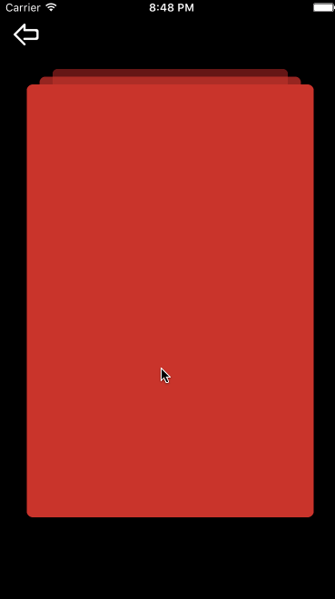

# S0001_CRCardAnimationViewDemo

##简介：
卡片切换动效

| demo信息    | 详情                  |
|:-----------:|:---------------------:|
| DemoName    | CRCardAnimationView   |
| CRID        | S0001                 |
| author      | Bear                  |
| authorMail  | 648070256@qq.com      |
| 源gitHub    | 无                    |
| 其他说明    | 无                    |

##使用：

###Pod
>pod ‘CRAnimation/Widget/CRCardAnimationView’

```
//  delegate
<CardAnimationViewDelegate>

//  init
CRCardAnimationView *cardAnimationView = [[CRCardAnimationView alloc] initWithFrame:CGRectMake(0, 0, WIDTH, HEIGHT)];
cardAnimationView.delegate = self;
cardAnimationView.cardShowInView_Count = 3;
cardAnimationView.cardOffSetPoint = CGPointMake(0, 30);
cardAnimationView.cardScaleRatio  = 0.09;
cardAnimationView.cardCycleShow = YES;
[self.view addSubview:_cardAnimationView];
```

###代理方法
```
#pragma mark - CardAnimationView delegate

//  和tableView中的cellForRow同理
- (CRCardViewCell *)cardViewInCardAnimationView:(CRCardAnimationView *)cardAnimationView Index:(int)index
{
CGFloat cardView_width = (1.0 * 540 / 640) * WIDTH;
CGFloat cardView_height = (1.0 * 811 / 1134) * HEIGHT;
NSString *cardViewID_Str = @"cardViewID_Str";

CRCardViewCell *cardView = (CRCardViewCell *)[cardAnimationView dequeueReusableCardViewCellWithIdentifier:cardViewID_Str];
if (!cardView) {
cardView = [[CRCardViewCell alloc] initWithFrame:CGRectMake(0, 0, cardView_width, cardView_height) reuseIdentifier:cardViewID_Str];
cardView.layer.cornerRadius = 7.0f;
}

cardView.backgroundColor = UIColorFromHEX(0xC9162C);

return cardView;
}

//  显示的card数量，和tableView中的numberOfRows同理
- (NSInteger)numberOfCardsInCardAnimationView:(CRCardAnimationView *)cardAnimationView
{
return 10;
}

//  最前面一个即将消失在屏幕中的cell
- (void)cardViewWillDisappearWithCardViewCell:(CRCardViewCell *)cardViewCell Index:(NSInteger)index
{
NSLog(@"will disappear index:%ld", (long)index);
}

//  最前面一个即将置于图层顶层的cell
- (void)cardViewWillShowInTopWithCardViewCell:(CRCardViewCell *)cardViewCell Index:(NSInteger)index
{
NSLog(@"will show index:%ld", (long)index);
}

```

## 属性列表
```
CGFloat   animationDuration_Normal;   //普通动画时间
int       cardShowInView_Count;       //可见的卡片数量
CGFloat   cardAlphaGapValue;          //相邻卡片alpha差值
CGPoint   cardOffSetPoint;            //相邻卡片偏移位置设定
CGFloat   cardScaleRatio;             //相邻卡片缩放比例

BOOL      cardCycleShow;              //卡片显示完毕后循环显示
BOOL      cardPanEnable;              //卡片是否允许拖动
BOOL      cardRotateWhenPan;          //卡片拖动时是否可旋转
CGFloat   cardRotateMaxAngle;         //卡片可旋转时:卡片可旋转的最大角度(角度制，如，90，180)
CGFloat   cardFlyMaxDistance;         //卡片不可旋转时:卡片移动超过某一值时就飞走的阈值
```
