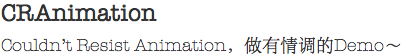

# CRAnimation计划

<left>

</left>

gitHub:<https://github.com/BearRan/CRAnimation>

### 简介：

CRAnimation为开源项目，CRAnimation Pod仓库中整理了各种封装好的动效代码，并且在App中可以直接体验Demo，并且能够直接交互。找到适合自己需要的Demo后，再去查看源代码。减少不必要的时间去下载，运行demo。

将动效做成Demo后，再进行封装，提供接口，这样能够方便开发者在最短的时间内集成自己需要的动效。

如果开发者对源码感兴趣，也可以研究源码，给作者提建议，提升代码质量，完善代码接口和功能。

CRAnimation

### 特色：

即使是很简单的Demo，通过我们的CRCoder和CRUED改变后，可以变得更有情调，更吸引其他开发者、产品经理、设计师的眼球，并且提升交互体验，方便开发者找到适合的Demo并进行集成。

---
##控件动效

- S0001
- CRCardAnimationView
- 卡片切换动效

CRCardAnimationView

- S0002
- CRImageGradientView
- ImageView过渡切换动效

CRImageGradientView

> S0003
> Gif demo
> Gif播放控件

Gif demo

>S0004
WCLLoadingView
Slack 的 Loading 动画

WCLLoadingView

---
##组合动效

>C0001
音乐切换动效
CRCardAnimationView和CRImageGradientView的组合动效

音乐切换动效

---
### Find

目前，我们急需UI设计师，产品经理，iOS动效工程师。

有意向者，可与管理员取得联系。

QQ:648070256熊熊

